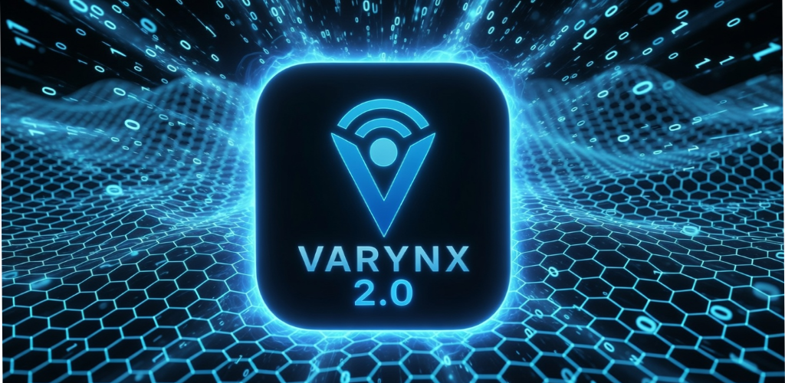

<p align="center">
  
</p>

<h1 align="center">VARYNX 2.0</h1>

<p align="center"><b>Multi-Platform Cybersecurity Mesh — Privacy-First Threat Intelligence Across Every Device</b></p>

[](https://github.com/M4urk/VARYNX-2.0)
[-green)](https://developer.android.com/about/versions/14)
[](https://kotlinlang.org/)
[](LICENSE)

&nbsp;

## Overview

VARYNX 2.0 is a fully offline security platform that protects all your devices through a local encrypted mesh network. No cloud. No accounts. No tracking. Your data never leaves your devices.

Where VARYNX 1.0 was a single-device Android guardian, **VARYNX 2.0 is a multi-platform organism** — a living security system that detects threats on any device, relays signals across your mesh, and responds with coordinated reflexes in real time.

### Key Principles

- **Zero Cloud Dependency** — All threat detection runs locally on your devices
- **No Data Collection** — We don't collect, transmit, or sell your data
- **Multi-Device Mesh** — Encrypted peer-to-peer sync with no central server
- **Non-Transitive Trust** — Every device must be explicitly paired by you
- **Fail-Closed** — The system defaults to a secure state on errors

&nbsp;

## Features

### Guardian Organism

A four-domain biological security cycle that runs continuously on every device:

- **Core** — Detection and signal intake across 17 protection modules
- **Engine** — Scoring, behavior analysis, threat clustering, and state machine
- **Reflex** — Automatic responses (block, warn, isolate, escalate, lockdown)
- **Identity** — Layered reflex chains and long-term behavioral memory

### Protection Modules (17 Active)

| Module | What It Does |
|--------|-------------|
| App Scanner | Detects malicious apps, sideload risks, suspicious package names |
| Network Monitor | Open networks, weak encryption, rogue access points, DNS tampering |
| Permission Analyzer | Flags dangerous permission combinations across installed apps |
| Bluetooth Skimmer Detector | BLE proximity scanning with pattern matching and RSSI analysis |
| NFC Monitor | Tap detection, secure element integrity, relay attack detection |
| Clipboard Guard | Monitors for sensitive data exposure (passwords, keys, seeds) |
| CryptoShield | Detects crypto drainer apps, clipboard hijacking, fake wallet QR codes |
| QR Scam Scanner | Camera-based QR scanning with URL risk scoring and threat heuristics |
| Overlay Detector | Screen overlay attack detection |
| Install Monitor | Real-time app install/uninstall tracking |
| Device State | Root detection, VPN status, developer mode, USB debugging |
| Security Audit Scanner | Full device security audit across all active modules |
| DNS Tamper Detector | Detects DNS spoofing and man-in-the-middle attacks |
| MITM Detector | Certificate validation and TLS interception detection |
| Accessibility Abuse | Detects malicious use of accessibility services |
| USB Threat Monitor | Unauthorized USB device and data transfer detection |
| Sensor Anomaly Detector | Hardware sensor manipulation and injection detection |

### Intelligence Modules (10 Active)

Adaptive learning modules that evolve with your device's behavior:

- Behavior Drift Detection — Detects gradual changes in device behavior patterns
- Threat Memory — Long-term threat association and recall
- Threat Clustering — Groups related threats for coordinated response
- Sequence Prediction — Predicts attack chains before they complete
- Pattern Correlation — Cross-module pattern matching
- Context Thresholds — Adaptive scoring based on device context
- Pack Validator — Validates module configuration integrity
- Anomaly Baseline — Learns normal behavior, flags deviations
- Identity Memory — Device identity and trust pattern memory
- Layered Reflex Chains — Multi-stage reflex coordination

### Encrypted Mesh Network

- **X25519 + Ed25519** key exchange and signing
- **AES-256-GCM** encrypted message envelopes
- **6-digit pairing** for physical proximity trust establishment
- **Non-transitive trust graph** — A trusts B, B trusts C does NOT mean A trusts C
- **Vector clock sync** — Conflict-free state merging across peers
- **Threat relay** — Threats detected on one device propagate to the entire mesh
- **Quorum lockdown** — Mesh-wide coordinated lockdown on critical threats
- **LAN + BLE transport** — Works on local networks and Bluetooth

### Multi-Platform Coverage

| Platform | Role | Description |
|----------|------|-------------|
| Android | Guardian | Full threat detection with real sensor data, camera QR scanning |
| Windows Desktop | Controller | JavaFX dashboard, mesh command center, IPC to service |
| Linux | Node | 5 dedicated OS engines (process, network, file integrity, USB, startup) |
| WearOS | Hub | Lightweight guardian for wrist-based proximity alerts |
| HomeHub | Controller | IoT mesh coordinator with device correlation and rogue detection |
| Pocket Node | Node | BLE proximity engine for portable mesh relay |
| Satellite Node | Node | Offline buffer with autonomous escalation and burst sync |

&nbsp;

## Architecture

```
┌─────────────────────────────────────────────────────────┐
│               VARYNX 2.0 — Mesh Organism                │
├─────────────────────────────────────────────────────────┤
│                                                         │
│  ┌──────────┐  ┌──────────┐  ┌──────────┐  ┌────────┐ │
│  │   CORE   │→ │  ENGINE  │→ │  REFLEX  │→ │IDENTITY│ │
│  │ 17 Detect│  │ Score +  │  │ 10 Auto  │  │ Memory │ │
│  │ Modules  │  │ Behavior │  │ Responses│  │+ Learn │ │
│  └──────────┘  └──────────┘  └──────────┘  └────────┘ │
│                                                         │
│  ┌─────────────────────────────────────────────────────┐│
│  │              MESH ENGINE                            ││
│  │  X25519/Ed25519 · AES-256-GCM · Trust Graph        ││
│  │  Heartbeat · Threat Relay · Quorum · Vector Clock   ││
│  └─────────────────────────────────────────────────────┘│
│                        │                                 │
├────────────────────────┼─────────────────────────────────┤
│  PLATFORMS             │                                 │
│  ┌──────┐ ┌──────┐ ┌──┴───┐ ┌──────┐ ┌──────┐ ┌──────┐│
│  │Android│ │Desktp│ │Linux │ │WearOS│ │Pocket│ │Satelt││
│  │Guard.│ │Contrl│ │Node  │ │Hub   │ │Node  │ │Node  ││
│  └──────┘ └──────┘ └──────┘ └──────┘ └──────┘ └──────┘│
└─────────────────────────────────────────────────────────┘
```

- **Kotlin Multiplatform** — Shared core across all platforms
- **78 registered modules** — 47 active in 2.0
- **Offline-only** — Zero network calls, zero cloud dependencies
- **Battery-aware** — 30-second guardian cycle with battery optimization
- **Secure IPC** — Desktop service binds to localhost with token authentication
- **Fail-closed** — Defaults to secure state on any error

&nbsp;

## Requirements

| Platform | Requirement |
|----------|------------|
| Android | Android 14+ (API 34) — No internet required |
| Windows | Windows 10+ with bundled JDK 21 runtime |
| Linux | Any x86_64 distro with JDK 21 |
| WearOS | Wear OS 4+ |

All permissions are requested at runtime with clear explanations. Denying a permission disables only the related module — the rest of the system continues to function.

&nbsp;

## Privacy

VARYNX collects **zero user data**:

- No analytics
- No crash reporting to external services
- No advertising identifiers
- No location tracking
- No network requests to any server
- No telemetry of any kind

All security data stays on your devices. Mesh communication is strictly device-to-device on your local network using end-to-end encryption. No data ever reaches the internet.

See [PRIVACY.md](PRIVACY.md) for the full privacy policy.

&nbsp;

## Tech Stack

| | |
|---|---|
| Language | Kotlin 2.2.10 (Multiplatform) |
| UI (Android) | Jetpack Compose + Material 3 |
| UI (Desktop) | JavaFX WebView + Ktor IPC |
| Background | Foreground Service (Android) · Daemon loops (JVM) |
| Crypto | X25519 · Ed25519 · AES-256-GCM · HKDF-SHA256 |
| Camera | CameraX 1.4.2 + ML Kit Barcode 17.3.0 |
| Build | Gradle 9.3.1 · AGP 9.1.0 · Compose 1.7.3 |
| Networking | Ktor 3.1.3 (local IPC only) |
| Serialization | kotlinx-serialization 1.8.1 |
| Min SDK | 34 (Android 14) |
| Target SDK | 36 (Android 16) |
| JDK | 21 (Eclipse Temurin) |

&nbsp;

## Testing

413 unit tests across 31 test suites, all passing.

```
# Full test suite
./gradlew test
```

| Module | Tests | Coverage |
|--------|-------|----------|
| core (GuardianOrganism) | 9 | Organism lifecycle, cycle loop |
| core (Engine) | 16 | Scoring, behavior, threat, state machine |
| core (Intelligence) | 21 | All 10 adaptive learning modules |
| core (Protection) | 12 | All 17 detection modules |
| core (Reflex) | 11 | All 10 reflex responses |
| core (ReflexPropagation) | 16 | Cross-domain reflex chains |
| core (ConcurrencyStress) | 16 | Multi-threaded race condition tests |
| core (Crypto) | 18 | AES-256-GCM, Ed25519, X25519, HKDF |
| core (MeshCrypto) | 12 | Encrypt-then-sign envelope verification |
| core (MeshIntegration) | 11 | Full mesh stack integration |
| core (MeshSync) | 13 | Peer state synchronization |
| core (MeshCoordinator) | 14 | Quorum, consensus, lockdown |
| core (PairingSession) | 14 | ECDH pairing handshake |
| core (TrustGraph) | 9 | Trust edges, revocation, snapshots |
| core (TrustPropagation) | 14 | Signed trust mutations |
| core (PolicyEngine) | 12 | Policy rule evaluation |
| core (SyncHandshake) | 13 | Sync protocol handshake |
| core (SyncMonitor) | 15 | Sync health monitoring |
| core (SyncValidator) | 12 | Message validation and rejection |
| core (EnvelopeCodec) | 15 | Binary envelope serialization |
| core (VectorClock) | 9 | Conflict-free clock merging |
| core (RetryPolicy) | 14 | Exponential backoff |
| core (DeltaCompression) | 13 | State delta compression |
| core (HomeHubController) | 14 | IoT coordinator logic |
| core (SatelliteController) | 18 | Offline buffer, burst sync |
| core (IdentityModule) | 13 | Device identity persistence |
| core (DeviceRoleRegistry) | 9 | Role definitions and capabilities |
| core (ModuleRegistry) | 14 | Module registration and lifecycle |
| core (GuardianPersistence) | 16 | Trust graph + stats persistence |
| service (IpcProtocol) | 19 | Desktop↔service IPC serialization |
| app (ExampleUnit) | 1 | Android build verification |

&nbsp;

## Roadmap

### V1 (Released) — Foundation

- 10 active security modules
- Background guardian with 10-min wall-clock cadence
- Encrypted audit logging
- Full offline operation
- Play Store ready

### V2 (Current — Beta) — Evolution

- 47 active modules across 7 categories
- Four-domain guardian organism (Core → Engine → Reflex → Identity)
- Multi-platform encrypted mesh (Android, Windows, Linux, WearOS, IoT)
- 8 device roles with role-aware capabilities
- Desktop Control Center with 12 navigation tabs
- Trust graph with non-transitive, user-approved trust
- 413 unit tests across 31 test suites

## Security

Found a vulnerability? Please report it responsibly.

**Do not open a public GitHub issue for security vulnerabilities.**

See [SECURITY.md](SECURITY.md) for our security policy and reporting process.

&nbsp;

## Contributing

We welcome bug reports and feature requests! See [CONTRIBUTING.md](CONTRIBUTING.md) for guidelines.

Please follow our [Code of Conduct](CODE_OF_CONDUCT.md) in all interactions.

&nbsp;

## License

Copyright &copy; 2026 VARYNX. All rights reserved.

This software is proprietary. See [LICENSE](LICENSE) for details.

&nbsp;

## Status

**Version 2.0.0-beta — Latest Release**

- 47 active security modules across 7 categories
- Guardian organism with four-domain detection cycle
- Encrypted mesh networking across 7 platforms
- 413 unit tests, 0 failures
- 8 release artifacts (Android AAB, Windows EXE, Linux, WearOS, HomeHub, Pocket, Satellite, Service)
- Fully offline operation
- Zero data collection

&nbsp;

## Contact

- **Email**: [varynx.contact@gmail.com](mailto:varynx.contact@gmail.com)
- **Issues**: [GitHub Issues](../../issues)
- **Security**: [SECURITY.md](SECURITY.md)
- **Website**: [varynxguard.com](https://varynxguard.com/)

&nbsp;

## Founder Story

I didn't build VARYNX because I wanted to make another app. I built it because I lived through the exact problems this project now solves.

For years, I saw people get targeted — myself included — by scams, fake apps, social engineering, and the kind of digital manipulation that preys on normal families who just want to use their devices safely. I saw how easy it was for a device to become a doorway for stress, fear, and financial damage. And I saw how most "security apps" weren't built for real people — they were built for data collection, cloud dependency, or marketing.

Nothing existed that was simple, offline, private, and built for real families who just want their devices to be safe without being tracked.

So I built it myself.

VARYNX started as a personal tool — a way to protect my own family. But the more I built, the more I realized the gap in the market: there was no offline guardian that stayed on your devices, respected privacy, and actually helped people understand what was happening across their digital life.

I'm not a corporation. I'm a founder, a parent, and the sole provider for my family. I built VARYNX at night, after work, through setbacks, rebuilds, and months of discipline. Every module, every detector, every decision was shaped by one mission:

**Give people real protection without taking anything from them.**

VARYNX Version 1 was the foundation — a stable, offline guardian that proved the architecture works. Version 2 is the evolution — a multi-platform mesh organism that protects every device you own through encrypted local communication that never touches the internet.

This project is not a trend, not a clone, and not a shortcut. It's the result of lived experience, real problems, and a commitment to building something that actually protects people.

VARYNX exists because it needed to. And it will keep growing because the mission is real.

— **Corey, Founder of VARYNX**

*Your security. Your devices. Your data.*
